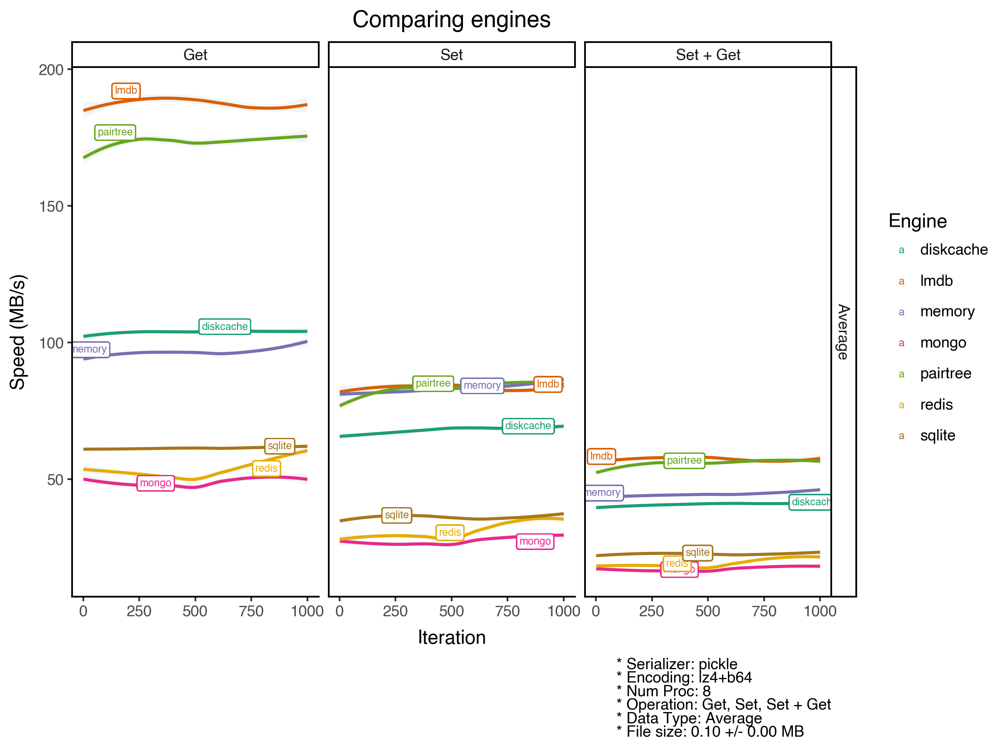
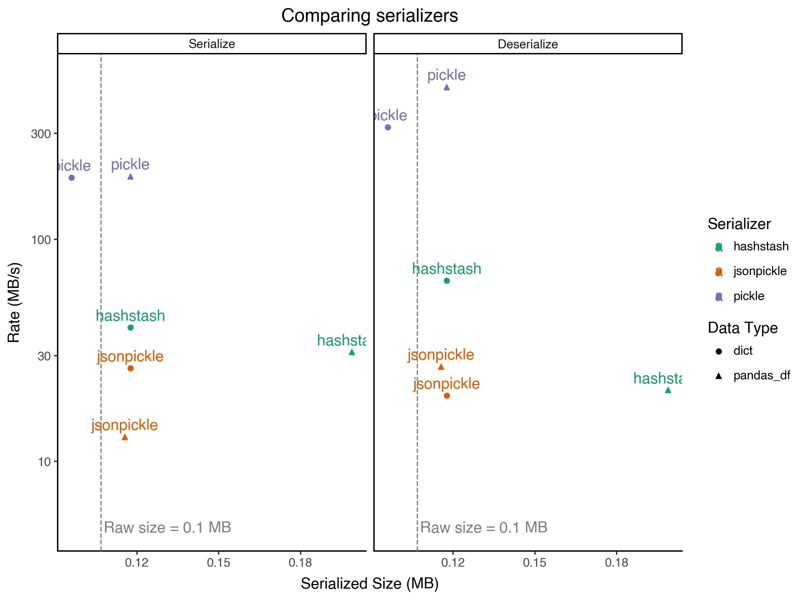
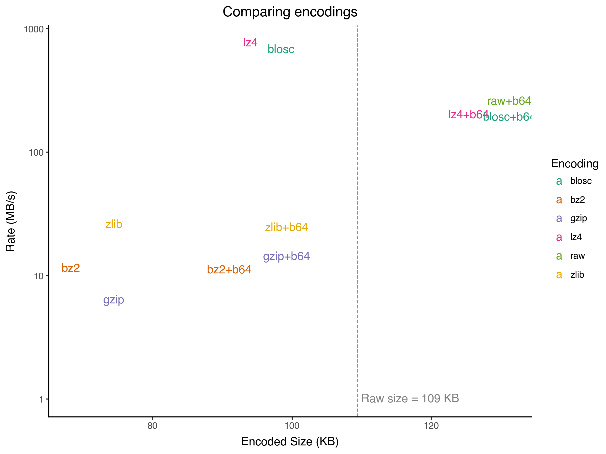
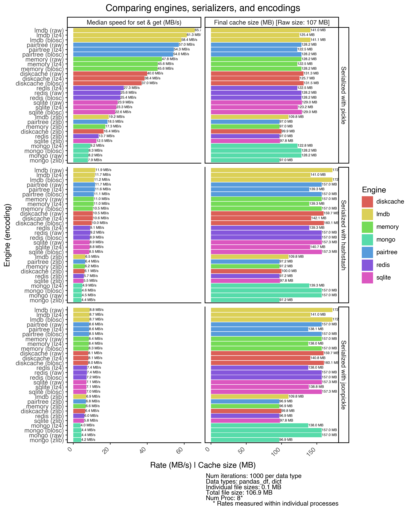

# HashStash

HashStash is a versatile caching library for Python that supports multiple storage engines, serializers, and encoding options. It provides a simple dictionary-like interface for caching data with various backend options. HashStash is designed to be easy to use, flexible, and efficient.

[](https://colab.research.google.com/github/quadrismegistus/hashstash/blob/main/README.ipynb)

## Features

### Convenient usage
- Dictionary-like interface, except absolutely anything can be either a key or value (even unhashable entities like sets or unpicklable entities like lambdas, local functions, etc)

- Multiprocessing support: connection pooling, multiprocessing locks, parallelize operations as much as a given engine allows

- Function decorators like `@stashed_result`, which cache the results of function calls

- Context managers for temporary caches

- Easy dataframe assembly from cached contents

### Multiple storage engines

- File-based
    - "__pairtree__" (no dependencies, no database; just organized folder and file structure; very fast)
    - "__[lmdb](https://pypi.org/project/lmdb/)__" (single file, very efficient, slightly faster than pairtree)
    - "__[diskcache](https://pypi.org/project/diskcache/)__" (similar to pairtree, but slower)
    - "__sqlite__" (using [sqlitedict](https://pypi.org/project/sqlitedict/))

- Server-based
    - "__redis__" (using [redis-py](https://pypi.org/project/redis/))
    - "__mongo__" (using [pymongo](https://pypi.org/project/pymongo/))

- In-memory
    - "__memory__" (shared memory, using [ultradict](https://pypi.org/project/ultradict/))

### Multiple serializers

- Transportable between Python versions
    - "__hashstash__"
        - Custom, no dependencies
        - Can serialize nearly anything, even lambdas or functions defined within functions
        - Serializes pandas dataframes using pyarrow if available
        - Faster than jsonpickle but with larger file sizes
        - Mostly JSON-based, with some binary data
    - "__[jsonpickle](https://pypi.org/project/jsonpickle/)__"
        - Flexible, battle-tested, but slowest

- Not transportable between Python versions
    - "__pickle__"
        - Standard library
        - By far the fastest
        - But dangerous to use when sharing data across projects or Python versions 

### Compression and encoding options
- External compressors (with depedencies):
    - "__[lz4](<https://pypi.org/project/python-lz4/)>)__" (fastest)
    - "__[blosc](https://pypi.org/project/blosc/)__"

- Built-in compressors (no dependencies):
    - "__zlib__"
    - "__gzip__"
    - "__bz2__" (smallest file size, but slowest)

## Installation

HashStash requires no dependencies by default, but you can install optional dependencies to get the best performance.

* Default installation: `pip install hashstash`

* Installation with only the optimal engine (lmdb), compressor (lz4), and dataframe serializer (pandas + pyarrow): `pip install hashstash[best]`

* Full installation with all optional dependencies: `pip install hashstash[all]`

* Installation with specific optional dependencies:

    - For pandas dataframe serialization and support: `pip install hashstash[dataframe]`

    - For file-based engines: `pip install hashstash[filebased]`

    - For server-based engines: `pip install hashstash[servers]`

    - For all engine types: `pip install hashstash[engines]`

    - For specific engines:
        - `pip install hashstash[redis]`
        - `pip install hashstash[mongo]`
        - `pip install hashstash[lmdb]`
        - `pip install hashstash[sqlite]`
        - `pip install hashstash[diskcache]`
        - `pip install hashstash[memory]`

    - For development: `pip install hashstash[dev]`

Note: You can combine multiple optional dependencies, e.g., `pip install hashstash[dataframe,filebased]`

```python
!pip install -qU hashstash[best]
```

## Usage

Here's a quick example of how to use HashStash. 

### Creating a stash

```python
from hashstash import HashStash

# Create a stash instance
stash = HashStash()

# or customize:
stash = HashStash(
    # naming
    root_dir="project_stash",    # root directory of the stash (default: default_stash)
                                 # if not an absolute path, will be ~/.cache/hashstash/[root_dir]
    dbname="sub_stash",          # name of "database" or subfolder (default: main)
    
    # engines
    engine="pairtree",           # or lmdb, sqlite, diskcache, redis, mongo, or memory
    serializer="hashstash",      # or jsonpickle or pickle
    compress='lz4',              # or blosc, bz2, gzip, zlib, or raw
    b64=True,                    # base64 encode keys and values

    # storage options
    append_mode=False,           # store all versions of a key/value pair
    clear=True                   # clear on init
)

# show stash type and path
print(stash)

# show stash config
stash.to_dict()
```

↓

    PairtreeHashStash(~/.cache/hashstash/project_stash/sub_stash/pairtree.hashstash.lz4+b64/data.db)

    {'root_dir': '/Users/ryan/.cache/hashstash/project_stash',
     'dbname': 'sub_stash',
     'engine': 'pairtree',
     'serializer': 'hashstash',
     'compress': 'lz4',
     'b64': True,
     'append_mode': False,
     'is_function_stash': False,
     'is_tmp': False,
     'filename': 'data.db'}

### Stashing objects

Literally anything can be a key or value, including lambdas, local functions, sets, dataframes, dictionaries, etc:

```python
# traditional dictionary keys,,,
stash["bad"] = "cat"                 # string key
stash[("bad","good")] = "cat"        # tuple key

# ...unhashable keys...
stash[{"goodness":"bad"}] = "cat"    # dict key
stash[["bad","good"]] = "cat"        # list key
stash[{"bad","good"}] = "cat"        # set key

# ...func keys...
def func_key(x): pass                
stash[func_key] = "cat"              # function key
lambda_key = lambda x: x
stash[lambda_key] = "cat"           # lambda key

# ...very unhashable keys...
import pandas as pd
df_key = pd.DataFrame(                  
    {"name":["cat"], 
     "goodness":["bad"]}
)
stash[df_key] = "cat"                # dataframe key  

# all should equal "cat":
(
    stash["bad"],
    stash[("bad","good")],
    stash[{"goodness":"bad"}],
    stash[["bad","good"]],
    stash[{"bad","good"}],
    stash[func_key],
    stash[lambda_key],
    stash[df_key]
)
```

↓

    ('cat', 'cat', 'cat', 'cat', 'cat', 'cat', 'cat', 'cat')

### Works like a dictionary

HashStash fully implements the dictionary's `MutableMapping` interface, providing all its methods, including:

```python
# get()
assert stash.get(df_key) == "cat"
assert stash.get('fake_key') == None

# __contains__
assert df_key in stash

# __len__
assert len(stash) == 8   # from earlier

# keys()
from hashstash import *
for i,key in enumerate(stash.keys()): 
    pass

# values()
for value in stash.values():
    assert value == "cat"

# items()
for i, (key, value) in enumerate(stash.items()):
    print(f'Item #{i+1}:\n{key} >>> {value}\n')

```

↓

    Item #1:
    {'good', 'bad'} >>> cat
    
    Item #2:
    {'goodness': 'bad'} >>> cat
    
    Item #3:
    bad >>> cat
    
    Item #4:
      name goodness
    0  cat      bad >>> cat
    
    Item #5:
    ('bad', 'good') >>> cat
    
    Item #6:
    ['bad', 'good'] >>> cat
    
    Item #7:
    <function func_key at 0x12846c160> >>> cat
    
    Item #8:
    <function <lambda> at 0x1291c0160> >>> cat
    

Other dictionary functions:

```python
# pop()
assert stash.pop(df_key) == "cat"
assert df_key not in stash

# setdefault()
assert stash.setdefault(df_key, "new_cat_default") == "new_cat_default"
assert stash.get(df_key) == "new_cat_default"

# update()
another_dict = {'new_key_of_badness': 'cat'}
stash.update(another_dict)
assert stash['new_key_of_badness'] == "cat"

# update() with another stash
another_stash = HashStash(engine='memory').clear()
another_stash[[1,2,3]] = "cat"
stash.update(another_stash)
assert stash[[1,2,3]] == "cat"
```

#### Under the hood

You can also iterate the keys and values as actually exist in the data store, i.e. serialized encoded:

- `_keys()`: Return an iterator over the encoded keys

- `_values()`: Return an iterator over the encoded values

- `_items()`: Return an iterator over the encoded key-value pai

These methods are used internally and not necessary to use.

```python
print('\nIterating over ._items():')
for encoded_key,encoded_value in stash._items():
    print(encoded_key, 'is the serialized, compressed, and encoded key for', encoded_value)
    decoded_key = stash.decode_key(encoded_key)
    decoded_value = stash.decode_value(encoded_value)
    print(decoded_key, 'is the decoded, uncompressed, and deserialized key for', decoded_value)
    break
```

↓

    
    Iterating over ._items():
    b'NwAAAPETeyJfX3B5X18iOiAiYnVpbHRpbnMuc2V0IiwgIl9fZGF0YRwA8AFbImdvb2QiLCAiYmFkIl19' is the serialized, compressed, and encoded key for b'BQAAAFAiY2F0Ig=='
    {'good', 'bad'} is the decoded, uncompressed, and deserialized key for cat

### Stashing function results

HashStash provides two ways of stashing results.

First, here's an expensive function:

```python
# Here's an expensive function

num_times_computed = 0

def expensive_computation(names,goodnesses=['good']):
    import random
    global num_times_computed
    num_times_computed += 1
    print(f'Executing expensive_computation time #{num_times_computed}')
    ld=[]
    for n in range(1_000_000):
        d={}
        d['name']=random.choice(names)
        d['goodness']=random.choice(goodnesses)
        d['random']=random.random()
        ld.append(d)
    return random.sample(ld,k=10)

names = ['cat', 'dog']
goodnesses=['good','bad']

# execute 2 times -- different results
unstashed_result1 = expensive_computation(names, goodnesses=goodnesses)
unstashed_result2 = expensive_computation(names, goodnesses=goodnesses)
```

↓

    Executing expensive_computation time #1
    Executing expensive_computation time #2

#### Method 1: Stashing function results via `stash.run()`

```python
## set up a stash to run the function in
functions_stash = HashStash('functions_stash', clear=True)

# execute time #3
stashed_result1 = functions_stash.run(expensive_computation, names, goodnesses=goodnesses)

# calls #4-5 will not execute but return stashed result
stashed_result2 = functions_stash.run(expensive_computation, names, goodnesses=goodnesses)
stashed_result3 = functions_stash.run(expensive_computation, names, goodnesses=goodnesses)
assert stashed_result1 == stashed_result2 == stashed_result3
```

↓

    Executing expensive_computation time #3

#### Method 2: Using function decorator `@stash.stashed_result`

```python
from hashstash import stashed_result

@functions_stash.stashed_result  # or @stashed_result("functions_stash") [same HashStash call args/kwargs]
def expensive_computation2(names, goodnesses=['good']):
    return expensive_computation(names, goodnesses=goodnesses)

# will run once
stashed_result4 = expensive_computation2(names, goodnesses=goodnesses)

# then cached even when calling it normally
stashed_result5 = expensive_computation2(names, goodnesses=goodnesses)
stashed_result6 = expensive_computation2(names, goodnesses=goodnesses)
assert stashed_result4 == stashed_result5 == stashed_result6
```

↓

    Executing expensive_computation time #4

#### Accessing function result stash
Once a function is stashed via either the methods above you can access its stash as an attribute of the function:

```python
# function now has .stash attribute, from either method
func_stash = expensive_computation.stash
func_stash2 = expensive_computation2.stash
assert len(func_stash) == len(func_stash2)
print(f'Function results cached in {func_stash}\n')

# can iterate over its results normally. Keys are: (args as tuple, kwargs as dict)
func_stash = func_stash2
for key, value in func_stash.items():
    args, kwargs = key
    print(f'Stashed key = {key}')
    print(f'Called args: {args}')
    print(f'Called kwargs: {kwargs}')
    print(f'\nStashed value = {value}')

# you can get result via normal get
stashed_result7 = func_stash.get(((names,), {'goodnesses':goodnesses}))

# or via special get_func function which accepts function call syntax
stashed_result8 = func_stash.get_func(names, goodnesses=goodnesses)

assert stashed_result7 == stashed_result8 == stashed_result5 == stashed_result6
```

↓

    Function results cached in LMDBHashStash(~/.cache/hashstash/functions_stash/lmdb.hashstash.lz4/stashed_result/__main__.expensive_computation/lmdb.hashstash.lz4/data.db)
    
    Stashed key = ((['cat', 'dog'],), {'goodnesses': ['good', 'bad']})
    Called args: (['cat', 'dog'],)
    Called kwargs: {'goodnesses': ['good', 'bad']}
    
    Stashed value = [{'name': 'dog', 'goodness': 'bad', 'random': 0.5057600020943653}, {'name': 'dog', 'goodness': 'bad', 'random': 0.44942716869985244}, {'name': 'dog', 'goodness': 'bad', 'random': 0.04412090932878976}, {'name': 'dog', 'goodness': 'good', 'random': 0.26390218890484296}, {'name': 'dog', 'goodness': 'good', 'random': 0.8861568169357764}, {'name': 'dog', 'goodness': 'bad', 'random': 0.8113840172104607}, {'name': 'dog', 'goodness': 'bad', 'random': 0.29450288091375965}, {'name': 'cat', 'goodness': 'good', 'random': 0.10650085474589033}, {'name': 'dog', 'goodness': 'bad', 'random': 0.10346094332240874}, {'name': 'cat', 'goodness': 'bad', 'random': 0.29552371113906584}]

### Mapping functions

You can also map functions across many objects, with stashed results, with `stash.map`. By default it uses {num_proc}-2 processors to start computing results in background. In the meantime it returns a `StashMap` object.

```python
def expensive_computation3(name, goodnesses=['good']):
    time.sleep(random.randint(1,5))
    return {'name':name, 'goodness':random.choice(goodnesses)}

# this returns a custom StashMap object instantly, computing results in background (if num_proc>1)
stash_map = functions_stash.map(expensive_computation3, ['cat','dog','aardvark','zebra'], goodnesses=['good', 'bad'], num_proc=2)
stash_map
```

↓

    Mapping __main__.expensive_computation3 across 4 objects [2x]:   0%|          | 0/4 [00:00<?, ?it/s]

    StashMap([StashMapRun(__main__.expensive_computation3('cat', goodnesses=['good', 'bad']) >>> ?),
              StashMapRun(__main__.expensive_computation3('dog', goodnesses=['good', 'bad']) >>> ?),
              StashMapRun(__main__.expensive_computation3('aardvark', goodnesses=['good', 'bad']) >>> ?),
              StashMapRun(__main__.expensive_computation3('zebra', goodnesses=['good', 'bad']) >>> ?)])

```python
# iterate over results as they come in:
timestart=time.time()
for result in stash_map.results_iter():
    print(f'[+{time.time()-timestart:.1f}] {result}')
```

↓

    Mapping __main__.expensive_computation3 across 4 objects [2x]:  50%|█████     | 2/4 [00:05<00:04,  2.42s/it]

    [+5.0] {'name': 'cat', 'goodness': 'good'}
    [+5.0] {'name': 'dog', 'goodness': 'good'}
    [+5.0] {'name': 'aardvark', 'goodness': 'good'}

    Mapping __main__.expensive_computation3 across 4 objects [2x]: 100%|██████████| 4/4 [00:09<00:00,  2.16s/it]

    [+9.0] {'name': 'zebra', 'goodness': 'bad'}

```python
# or wait for as a list
stash_map.results
```

↓

                                                                                                                

    [{'name': 'cat', 'goodness': 'good'},
     {'name': 'dog', 'goodness': 'good'},
     {'name': 'aardvark', 'goodness': 'good'},
     {'name': 'zebra', 'goodness': 'bad'}]

```python
# or by .items() or .keys() or .values()
for (args,kwargs),result in stash_map.items():
    print(f'{args} {kwargs} >>> {result}')
```

↓

    ('cat',) {'goodnesses': ['good', 'bad']} >>> {'name': 'cat', 'goodness': 'good'}
    ('dog',) {'goodnesses': ['good', 'bad']} >>> {'name': 'dog', 'goodness': 'good'}
    ('aardvark',) {'goodnesses': ['good', 'bad']} >>> {'name': 'aardvark', 'goodness': 'good'}
    ('zebra',) {'goodnesses': ['good', 'bad']} >>> {'name': 'zebra', 'goodness': 'bad'}

```python
# the next time, it will return stashed results, and compute only new values
stash_map2 = functions_stash.map(expensive_computation3, ['cat','dog','elephant','donkey'], goodnesses=['good', 'bad'], num_proc=2)
stash_map2
```

↓

    Mapping __main__.expensive_computation3 across 4 objects [2x]:   0%|          | 0/4 [00:00<?, ?it/s]

    StashMap([StashMapRun(__main__.expensive_computation3('cat', goodnesses=['good', 'bad']) >>> ?),
              StashMapRun(__main__.expensive_computation3('dog', goodnesses=['good', 'bad']) >>> ?),
              StashMapRun(__main__.expensive_computation3('elephant', goodnesses=['good', 'bad']) >>> ?),
              StashMapRun(__main__.expensive_computation3('donkey', goodnesses=['good', 'bad']) >>> ?)])

```python
# heavily customizable
stash_map3 = functions_stash.map(
    expensive_computation3, 
    objects=['cat','parrot'],               # (2 new animals
    options=[{'goodnesses':['bad']}, {}],   # list of dictionaries for specific keyword arguments
    goodnesses=['good', 'bad'],             # keyword arguments common to all function calls
    num_proc=4,                             # number of processes to use
    preload=True,                           # start loading stashed results on init
    precompute=True,                        # start computing stashed results 
    progress=True,                          # show progress bar
    desc="Mapping expensive_computation3",  # description for progress bar
    ordered=True,                           # maintain order of input
    stash_runs=True,                        # store individual function runs
    stash_map=True,                         # store the entire map result
    _force=False,                           # don't force recomputation if results exist
)
```

↓

    

```python
# Can also use as a decorator

@stash_mapped('function_stash', num_proc=1)
def expensive_computation4(name, goodnesses=['good']):
    time.sleep(random.randint(1,5))
    return {'name':name, 'goodness':random.choice(goodnesses)}

expensive_computation4(['mole','lizard','turkey'])
```

↓

    
    

    StashMap([StashMapRun(__main__.expensive_computation4('mole', root_dir='function_stash') >>> {'name': 'mole', 'goodness': 'good'}),
              StashMapRun(__main__.expensive_computation4('lizard', root_dir='function_stash') >>> {'name': 'lizard', 'goodness': 'good'}),
              StashMapRun(__main__.expensive_computation4('turkey', root_dir='function_stash') >>> {'name': 'turkey', 'goodness': 'good'})])

### Assembling DataFrames

HashStash can assemble DataFrames from cached contents, even nested ones. First, examples from earlier:

```python
# assemble list of flattened dictionaries from cached contents
func_stash.ld                # or stash.assemble_ld()

# assemble dataframe from flattened dictionaries of cached contents
print(func_stash.df)         # or stash.assemble_df()
```

↓

      name goodness    random
    0  dog      bad  0.505760
    1  dog      bad  0.449427
    2  dog      bad  0.044121
    3  dog     good  0.263902
    4  dog     good  0.886157
    5  dog      bad  0.811384
    6  dog      bad  0.294503
    7  cat     good  0.106501
    8  dog      bad  0.103461
    9  cat      bad  0.295524

Nested data flattening:

```python
# can also work with nested data
nested_data_stash = HashStash(engine='memory', dbname='assembling_dfs')

# populate stash with random animals
import random
for n in range(100):
    nested_data_stash[f'Animal {n+1}'] = {
        'name': (cat_or_dog := random.choice(['cat', 'dog'])), 
        'goodness': (goodness := random.choice(['good', 'bad'])),
        'etc': {
            'age': random.randint(1, 10),
            'goes_to':{
                'heaven':True if cat_or_dog=='dog' or goodness=='good' else False,
            }
        }
    }

# assemble dataframe from flattened dictionaries of cached contents
print(nested_data_stash.df)         # or stash.assemble_df()
```

↓

               name goodness  etc.age  etc.goes_to.heaven
    _key                                                 
    Animal 1    cat     good        9                True
    Animal 2    cat      bad        8               False
    Animal 3    cat     good        6                True
    Animal 4    dog      bad        7                True
    Animal 5    dog      bad       10                True
    ...         ...      ...      ...                 ...
    Animal 96   dog      bad        2                True
    Animal 97   dog      bad        8                True
    Animal 98   cat      bad        9               False
    Animal 99   cat     good        5                True
    Animal 100  cat     good        9                True
    
    [100 rows x 4 columns]

### Append mode

Keep track of all versions of a key/value pair. All engines can track version number; "pairtree" tracks timestamp as well.

```python
append_stash = HashStash("readme_append_mode", engine='pairtree', append_mode=True, clear=True)
key = {"name":"cat"}
append_stash[key] = {"goodness": "good"}
append_stash[key] = {"goodness": "bad"}

print(f'Latest value: {append_stash.get(key)}')
print(f'All values: {append_stash.get_all(key)}')
print(f'All values with metadata: {append_stash.get_all(key, with_metadata=True)}')
```

↓

    Latest value: {'goodness': 'bad'}
    All values: [{'goodness': 'good'}, {'goodness': 'bad'}]
    All values with metadata: [{'_version': 1, '_timestamp': 1725652978.878733, '_value': {'goodness': 'good'}}, {'_version': 2, '_timestamp': 1725652978.878886, '_value': {'goodness': 'bad'}}]

Can also get metadata on dataframe:

```python
print(append_stash.assemble_df(with_metadata=True))
```

↓

                          name goodness
    _version _timestamp                
    1        1.725653e+09  cat     good
    2        1.725653e+09  cat      bad

### Temporary Caches

HashStash provides a `tmp` method for creating temporary caches that are automatically cleaned up. The temporary cache is automatically cleared and removed after the with block:

```python
with stash.tmp() as tmp_stash:
    tmp_stash["key"] = "value"
    print("key" in tmp_stash)
    
print("key" in tmp_stash)
```

↓

    True
    False

### Utilities

#### Serialization

HashStash supports multiple serialization methods:

- `serialize`: Serializes Python objects
- `deserialize`: Deserializes data back into Python objects

```python
from hashstash import serialize, deserialize

data = pd.DataFrame({"name": ["cat", "dog"], "goodness": ["good", "bad"]})
serialized_data = serialize(data, serializer="hashstash") # or jsonpickle or pickle
deserialized_data = deserialize(serialized_data, serializer="hashstash")

data.equals(deserialized_data)
```

↓

    True

### Encoding and Compression

HashStash provides functions for encoding and compressing data:

- `encode`: Encodes and optionally compresses data
- `decode`: Decodes and decompresses data

These functions are used internally by HashStash but can also be used directly:

```python
from hashstash import encode, decode

data = b"Hello, World!"
encoded_data = encode(data, compress='lz4', b64=True)
decoded_data = decode(encoded_data, compress='lz4', b64=True)

data == decoded_data
```

↓

    True

    Mapping __main__.expensive_computation3 across 4 objects [2x]: 6it [00:04,  1.45it/s]               

## Profiling

### Engines

LMDB is the fastest engine, followed by the custom "pairtree" implementation.



### Serializers

Pickle is by far the fastest serializer, but it is not transportable between Python versions. HashStash is generally faster than jsonpickle, and can serialize more data types (including lambdas and functions within functions), but it produces larger file sizes.



### Encodings

LZ4 is the fastest compressor, but it requires an external dependency. BZ2 is the slowest, but it provides the best compression ratio.



### All together

LMDB engine, with pickle serializer, with no compression (raw) or LZ4 or blosc compression is the fastest combination of parameters; followed by pairtree with the same. 



## Development

### Tests

To run the tests, clone this repository and run  `pytest` in the root project directory.

### Contributing

Contributions are welcome! Please feel free to submit a Pull Request.

### License

This project is licensed under the GNU License.
