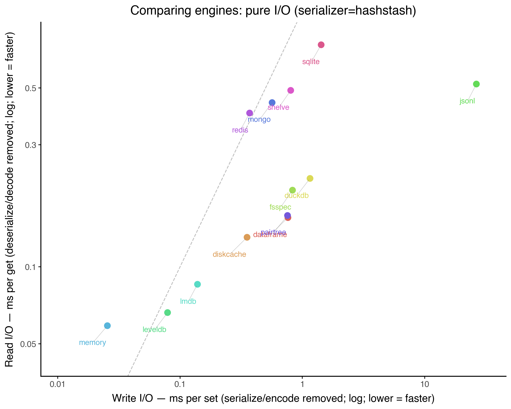
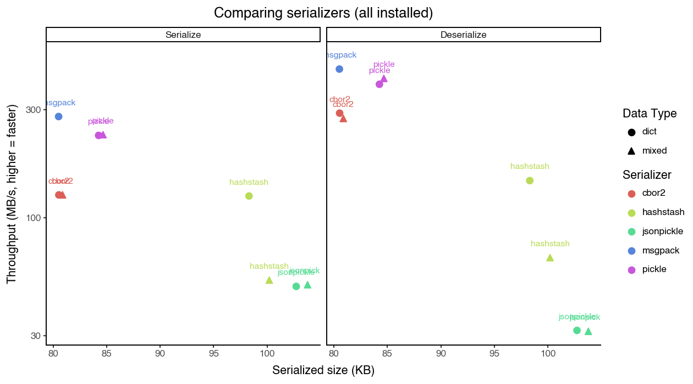
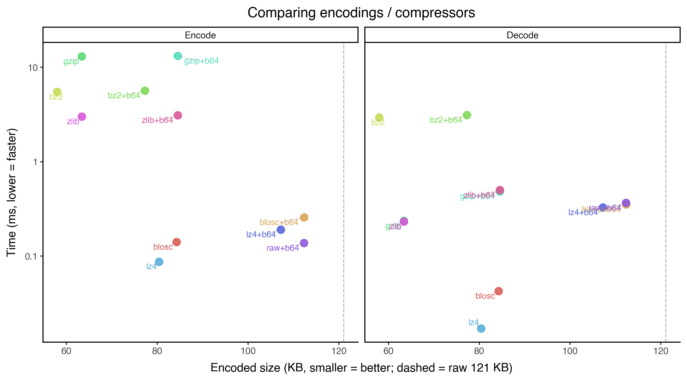

# HashStash

HashStash is a versatile caching library for Python that supports multiple storage engines, serializers, and encoding options. It provides a simple dictionary-like interface for caching data with various backend options. HashStash is designed to be easy to use, flexible, and efficient.

[](https://colab.research.google.com/github/quadrismegistus/hashstash/blob/main/README.ipynb)

## Table of Contents

- [Features](#features)
  - [Convenient usage](#convenient-usage)
  - [Multiple storage engines](#multiple-storage-engines)
  - [Multiple serializers](#multiple-serializers)
  - [Compression and encoding options](#compression-and-encoding-options)
- [Comparison to alternatives](#comparison-to-alternatives)
- [Installation](#installation)
- [Security](#security)
- [Usage](#usage)
  - [Creating a stash](#creating-a-stash)
  - [Stashing objects](#stashing-objects)
  - [Works like a dictionary](#works-like-a-dictionary)
  - [Stashing function results](#stashing-function-results)
  - [Mapping functions](#mapping-functions)
  - [Assembling DataFrames](#assembling-dataframes)
  - [Append mode](#append-mode)
  - [Temporary Caches](#temporary-caches)
  - [Utilities](#utilities)
    - [Serialization](#serialization)
    - [Encoding and Compression](#encoding-and-compression)
- [GraphStash](#graphstash)
  - [Nodes and edges](#nodes-and-edges)
  - [Multigraph support](#multigraph-support)
  - [Edge queries](#edge-queries)
  - [Traversal](#traversal)
  - [Bulk loading and performance](#bulk-loading-and-performance)
- [Profiling](#profiling)
  - [Engines](#engines)
  - [Serializers](#serializers)
  - [Encodings](#encodings)
- [Reference](#reference)
  - [Storage engines](#storage-engines)
  - [Serializers](#serializers-1)
  - [Compression & encoding](#compression--encoding)
- [Development](#development)
  - [Tests](#tests)
  - [Contributing](#contributing)
  - [License](#license)

## Features

### Convenient usage
- Dictionary-like interface, except absolutely anything can be either a key or value (even unhashable entities like sets or unpicklable entities like lambdas, local functions, etc)

- Multiprocessing support: connection pooling and locking parallelize operations as much as the specific engine allows

- Functions like `stash.run` and decorators like `@stashed_result` cache the results of function calls

- Functions like `stash.map` and `@stash_mapped` parallelize function calls across many objects, with stashed results

- Easy dataframe assembly from cached contents

### Multiple storage engines

- File-based
    - "__pairtree__" (no dependencies, no database; just organized folder and file structure; very fast; safe for concurrent writers)
    - "__[lmdb](https://pypi.org/project/lmdb/)__" (single file, very efficient, slightly faster than pairtree; auto-grows its map on demand)
    - "__[diskcache](https://pypi.org/project/diskcache/)__" (similar to pairtree, but slower)
    - "__sqlite__" (using [sqlitedict](https://pypi.org/project/sqlitedict/))
    - "__[duckdb](https://pypi.org/project/duckdb/)__" (embedded SQL database; indexed key-value store)
    - "__[leveldb](https://pypi.org/project/plyvel/)__" (embedded LSM key-value store via plyvel; no fixed size to pre-allocate)
    - "__jsonl__" (no dependencies; single human-readable append-only log. An incrementally-built key→offset index makes random single-key `get` an **O(1) seek** (no full-file scan), so it is fast for reads as well as writes and works well as a compact, inspectable cache — see note on concurrent writes below; call `stash.compact()` to reclaim space from overwritten/deleted rows)
    - "__shelve__" (standard library; simple dbm-backed store)
    - "__dataframe__" (pairtree layout that stores pandas DataFrames natively as feather/parquet/csv files — a polars DataFrame is converted to pandas on store; requires [pandas](https://pypi.org/project/pandas/))

- Server-based
    - "__redis__" (using [redis-py](https://pypi.org/project/redis/))
    - "__mongo__" (using [pymongo](https://pypi.org/project/pymongo/))

- Object storage / remote
    - "__[fsspec](https://pypi.org/project/fsspec/)__" (the pairtree layout over any fsspec filesystem — S3, GCS, Azure, SFTP, or `memory://` — for a serverless shared cache; `root_dir="s3://bucket/cache"`)

- In-memory
    - "__memory__" (shared across processes when [ultradict](https://pypi.org/project/ultradict/) is installed; otherwise a process-local dict)

### Multiple serializers

- Transportable between Python versions
    - "__hashstash__"
        - Custom, no dependencies
        - Can serialize nearly anything, even lambdas or functions defined within functions
        - Serializes pandas dataframes using pyarrow if available
        - Faster than jsonpickle but with larger file sizes
        - Mostly JSON-based, with some binary data
        - Uses [orjson](https://pypi.org/project/orjson/) to speed up value encoding when installed (cache keys stay stdlib-canonical either way)
    - "__[jsonpickle](https://pypi.org/project/jsonpickle/)__"
        - Flexible, battle-tested, but slowest
    - "__[msgpack](https://pypi.org/project/msgpack/)__" / "__[cbor2](https://pypi.org/project/cbor2/)__"
        - Fast, compact, binary, and **data-only** (cannot encode code) — a safe pairing with `safe=True` for shared caches

- Not transportable between Python versions
    - "__pickle__"
        - Standard library
        - By far the fastest
        - But dangerous to use when sharing data across projects or Python versions 

### Compression and encoding options
- External compressors (with depedencies):
    - "__[lz4](<https://pypi.org/project/python-lz4/)>)__" (fastest)
    - "__[blosc](https://pypi.org/project/blosc/)__"

- Built-in compressors (no dependencies):
    - "__zlib__"
    - "__gzip__"
    - "__bz2__" (smallest file size, but slowest)

## Comparison to alternatives

HashStash's niche is **caching arbitrary Python objects, portably, across many backends, with an optional safe-load mode** — no single alternative covers all four at once:

| | Caches *arbitrary* Python (lambdas, closures, objects) | Portable across Python versions | Pluggable backends | Data-only *safe* load |
|---|:---:|:---:|:---:|:---:|
| **hashstash** | ✅ | ✅ | ✅ (13 engines) | ✅ |
| [`diskcache`](https://pypi.org/project/diskcache/) | pickle only | ❌ | ❌ (disk) | ❌ |
| [`joblib`](https://pypi.org/project/joblib/)`.Memory` | pickle only | ❌ | ~ (disk / custom store) | ❌ |
| [`klepto`](https://pypi.org/project/klepto/) | partial | partial | ✅ | ❌ |
| [`cloudpickle`](https://pypi.org/project/cloudpickle/) / [`dill`](https://pypi.org/project/dill/) | ✅ | ❌ | n/a (serializer) | ❌ |
| [`jsonpickle`](https://pypi.org/project/jsonpickle/) | partial | ✅ | n/a (serializer) | partial |
| [`cachetools`](https://pypi.org/project/cachetools/) | ❌ | n/a | ❌ (in-memory) | n/a |

**When to reach for something else:** for a fast *local* function-result cache, `diskcache` and `joblib.Memory` are faster and more battle-tested; for in-memory LRU/TTL, `cachetools`. HashStash earns its place when you need to cache *anything* (closures, DataFrames, model objects), **move between backends** (local dict → shared Redis/S3) without a rewrite, **stay portable across Python versions**, and optionally load untrusted caches safely — all behind one dict-like API. It trades raw speed for that flexibility (see [BENCHMARKS.md](./BENCHMARKS.md)).

## Installation

HashStash requires no dependencies by default, but you can install optional dependencies to get the best performance.

* Default installation (no dependencies): `pip install hashstash`

* Best performance (lmdb engine + lz4 compression): `pip install hashstash[best]`

* Full installation with all optional dependencies: `pip install hashstash[all]`

* Development installation: `pip install hashstash[dev]`

For all options see [pyproject.toml](./pyproject.toml) under [project.optional-dependencies].

```python
!pip install -qU hashstash[best]
```

## Security

**Never open a stash you don't trust.** Deserializing a stash executes
code: the `pickle` serializer is `pickle.loads`, and the default
`hashstash` serializer can reconstruct functions and classes from stored
source (via `exec`) and invoke constructors by importable name. A
malicious value written into a shared cache (a shared Redis/Mongo
server, a synced or world-writable directory, a downloaded stash file)
can run arbitrary code on your machine when it is read back.

Treat a stash like you treat a pickle file: only read caches written by
code you trust, and don't point shared/networked engines at databases
other parties can write to.

### Safe mode

For shared or untrusted caches, open the stash with `safe=True` (or set
`HASHSTASH_SAFE=1` for the whole process). Safe mode restricts deserialization
to **data** — primitives, containers, bytes, sets, paths, datetimes, numpy/
pandas via a vetted table, and an allowlist of value-type constructors — and
raises `SafeDeserializationError` on anything that would execute code
(functions, classes, instances, arbitrary reducers):

```python
stash = HashStash(safe=True)          # requires the 'hashstash' serializer
stash["data"] = {"user": "alice", "when": datetime.now()}   # fine
stash["data"]                          # data round-trips normally
# a function-valued entry written by someone else raises on read
```

The **`msgpack`** serializer (`serializer="msgpack"`, `pip install
hashstash[msgpack]`) is data-only by construction — it cannot encode code at
all — making it a fast, compact, inherently-safe choice for shared caches.

#### Safe by default on shared engines

Because the risk of a hostile value comes from caches other parties can write
to, **networked engines default to safe mode**: `redis`, `mongo`, and remote
`fsspec` roots (`s3://`, `gcs://`, `sftp://`, …) open with `safe=True` unless
you say otherwise. Local file engines you own (`pairtree`, `lmdb`, `sqlite`,
…) stay code-capable, so caching a lambda locally works out of the box.

```python
HashStash(engine="redis")                 # safe=True by default
HashStash(engine="redis", safe=False)     # opt back into code execution (trust the writer)
HashStash(root_dir="s3://bucket/cache")   # remote fsspec -> safe=True by default
HashStash()                               # local default engine -> code-capable
```

If you rely on caching functions/objects to a shared engine, pass `safe=False`
explicitly to acknowledge that you trust whoever writes to it.

## Engines & semantics

### Choosing an engine

| Use case | Recommended engine |
|---|---|
| General-purpose cache, zero deps | `pairtree` |
| Maximum throughput, single-process | `lmdb` |
| Many concurrent writers (e.g. `task.map` workers) | `pairtree` (one file per entry — naturally collision-free) |
| Large cache (>10K entries), indexed queries | `sqlite` or `lmdb` |
| Human-inspectable log you want to `grep` / `jq` / `rsync` as one file | `jsonl` |
| Shared across processes without a server | `pairtree`, `lmdb`, `sqlite`, `jsonl` |
| Networked / multi-host | `redis`, `mongo` |
| Shared cache on object storage (S3/GCS/Azure), no server | `fsspec` |
| Ephemeral in-process | `memory` |

### `append_mode`

By default, setting the same key twice overwrites the old value. With `append_mode=True`, every write is retained as a new version and the key's history is queryable:

```python
stash = HashStash(engine="pairtree", append_mode=True)
stash["k"] = "v1"
stash["k"] = "v2"
stash["k"]            # -> "v2"  (latest)
stash.get_all("k")    # -> ["v1", "v2"]  (full history)
```

Use `append_mode=True` when you want reproducibility or audit history (e.g. caching LLM responses across prompt revisions). Leave it off for ordinary overwrite semantics.

### TTL (time-to-live)

Give a stash a `ttl` (seconds or a `timedelta`) and entries older than that read as absent — `get` returns the default, `in` says no, and `@stashed_result`/`run` recompute:

```python
stash = HashStash(ttl=3600)          # results live for an hour
stash["k"] = expensive()             # fresh for 3600s, then a miss
```

TTL is enforced on read (works identically on every engine); expired entries still occupy storage until you reclaim them with `stash.prune(older_than=..., dry_run=False)`, which deliberately still sees expired entries.

### Single-flight caching

`stash.run`, `@stashed_result`, and `stash.get_set` are single-flight by default: concurrent callers (threads or processes on one machine) that miss on the same key wait for one compute instead of all executing the function. Opt out per call with `_single_flight=False` (or `single_flight=False` for `get_set`). The locks are striped files next to the stash, so they cannot span hosts — multi-host redis/mongo callers may still occasionally double-compute.

### Statistics and invalidation

```python
stash.stats                    # {'hits': 10, 'misses': 3, 'sets': 3, 'deletes': 0}
stash.reset_stats()

@stashed_result
def f(x): ...
f(2)                           # computes
f.invalidate(2)                # drops that one cached call signature -> True
f(2)                           # recomputes
stash.invalidate(key)          # plain-stash form
```

Counters are shared by every stash instance pointing at the same path, per process.

### Exception caching

By default a function that raises is re-executed on every call. Opt into caching
failures so an expensive call that fails isn't retried until you want it to:

```python
stash.run(fetch, url, _cache_exceptions=True, _exception_ttl=60)

@stashed_result
def fetch(url): ...
fetch(url, _cache_exceptions=True)   # a raised exception is cached and re-raised
```

The original exception type is preserved (so `except OriginalError` still
catches it); an `_exception_ttl` gives failures their own (usually shorter)
lifetime, and `_force` bypasses the cached failure. Works under `safe=True`.

### Size-bounded eviction

`HashStash(max_entries=N)` caps the entry count: when a write pushes the total past `N`, the oldest entries (by write time) are evicted down to ~90% of the limit. Eviction is amortized (fires roughly once per `N/10` writes) and scans timestamps when it fires, so it's best on engines with cheap `len` (sqlite/lmdb/redis/mongo/memory) or moderate caches. Combine with `ttl` for "expire after T, and never exceed N entries."

### Async

Every stash exposes `await stash.aget(k)`, `aset`, `ahas`, and `arun(func, ...)`, which run the blocking storage work off the event loop. `@stashed_result` transparently supports `async def` — it awaits the coroutine and caches the *result* (not the coroutine object):

```python
@stashed_result
async def fetch(url):
    return await http_get(url)

await fetch("https://...")   # computes and caches
await fetch("https://...")   # returns the cached result, no await of the function
```

### `items()`, `keys()`, and `values()` are lazy

All three are generators — they yield as they read, so you can iterate a multi-GB stash without loading it into memory:

```python
for key in stash.keys():              # lazy, no values loaded
    if matches_filter(key):
        value = stash[key]            # only decode values you actually need
```

If you want an eager list, call `stash.keys_l()` / `values_l()` / `items_l()` (the `_l` suffix means "list").

### JSONL engine: tradeoffs to know

The JSONL engine writes every entry as a JSON line appended to a single file. Concurrent writes are serialized through the standard multiprocessing lock (same one other engines use), so the log stays consistent under `stash.map` with `num_proc>1`. The main tradeoff is read cost: resolving any single key requires scanning the file, so JSONL is best for write-once / iterate-many workloads (exports, analysis caches, human-inspectable logs). For write-heavy or low-latency random-access workloads, prefer `pairtree` (no shared file) or `lmdb` (indexed).

Also note: deletes and overwrites append tombstones / new versions rather than rewriting the file, so the file grows over time. A periodic rewrite (read all live entries, write to a fresh file) is a reasonable compaction strategy if space matters.

## TypedStash: schema-aware view over a stash

`TypedStash` is a thin wrapper that applies a loader (and optional dumper) on the way in/out of an underlying stash. It's generic — works with pydantic, dataclasses, msgspec, or any callable that turns a raw value into your domain type.

```python
from hashstash import HashStash, TypedStash
from pydantic import BaseModel

class Response(BaseModel):
    text: str
    tokens: int

stash = HashStash(engine="jsonl", dbname="llm_responses")
typed = TypedStash(
    stash,
    loader=Response.model_validate,       # raw dict → Response on read
    dumper=lambda r: r.model_dump(),      # Response → raw dict on write (optional)
)

typed["k"] = Response(text="hi", tokens=12)   # dumper runs
r = typed["k"]                                 # loader runs; r is a Response
```

**Per-call error policy** — because real caches accumulate bad rows over time:

```python
# Iteration defaults to 'skip': log a warning, keep going
for key, response in typed.items():
    ...

# Single-item get defaults to 'raise': bugs propagate instead of silently returning None
r = typed.get("key")                        # raises if loader fails

# Other modes: 'raise' on iteration, 'skip' on get, or 'return' to get the Exception back
for key, result in typed.items(on_error="return"):
    if isinstance(result, Exception):
        ...
```

**`filter(predicate)`** runs the predicate on raw keys and only calls the loader for matches — so a selective filter over a 40k cache doesn't pay the parse cost on rows you discard:

```python
for key, response in typed.filter(lambda k: "claude-sonnet-4-6" in k):
    analyze(response)
```

Multiple `TypedStash` views can wrap the same underlying stash — useful for schema migrations, where you read through an old loader and write through a new one.

## Usage

Here's a quick example of how to use HashStash. 

### Creating a stash

```python
from hashstash import HashStash

# Create a stash instance
stash = HashStash()

# or customize:
stash = HashStash(
    # naming
    root_dir="project_stash",    # bare name -> ~/.cache/hashstash/project_stash;
                                 # paths ("./cache", "data/cache", "/abs/path", "~/x")
                                 # resolve like any file path
    dbname="sub_stash",          # name of "database" or subfolder (default: None)

    # engines
    engine="pairtree",           # or lmdb, sqlite, diskcache, jsonl, shelve,
                                 # dataframe, redis, mongo, or memory
    serializer="hashstash",      # or jsonpickle or pickle
    compress='lz4',              # or blosc, bz2, gzip, zlib, or raw
    b64=True,                    # base64 encode keys and values

    # storage options
    append_mode=False,           # store all versions of a key/value pair
    ttl=3600,                    # optional: entries expire after this many seconds
    clear=True                   # clear on init
)

# show stash type and path
print(stash)

# show stash config
stash.to_dict()
```

↓

    PairtreeHashStash(~/.cache/hashstash/project_stash/sub_stash/pairtree.hashstash.lz4+b64/data.db)

    {'root_dir': '/Users/ryan/.cache/hashstash/project_stash',
     'dbname': 'sub_stash',
     'engine': 'pairtree',
     'serializer': 'hashstash',
     'compress': 'lz4',
     'b64': True,
     'append_mode': False,
     'is_function_stash': False,
     'is_tmp': False,
     'filename': 'data.db'}

### Stashing objects

Literally anything can be a key or value, including lambdas, local functions, sets, dataframes, dictionaries, etc:

```python
# traditional dictionary keys,,,
stash["bad"] = "cat"                 # string key
stash[("bad","good")] = "cat"        # tuple key

# ...unhashable keys...
stash[{"goodness":"bad"}] = "cat"    # dict key
stash[["bad","good"]] = "cat"        # list key
stash[{"bad","good"}] = "cat"        # set key

# ...func keys...
def func_key(x): pass                
stash[func_key] = "cat"              # function key
lambda_key = lambda x: x
stash[lambda_key] = "cat"           # lambda key

# ...very unhashable keys...
import pandas as pd
df_key = pd.DataFrame(                  
    {"name":["cat"], 
     "goodness":["bad"]}
)
stash[df_key] = "cat"                # dataframe key  

# all should equal "cat":
(
    stash["bad"],
    stash[("bad","good")],
    stash[{"goodness":"bad"}],
    stash[["bad","good"]],
    stash[{"bad","good"}],
    stash[func_key],
    stash[lambda_key],
    stash[df_key]
)
```

↓

    ('cat', 'cat', 'cat', 'cat', 'cat', 'cat', 'cat', 'cat')

### Works like a dictionary

HashStash fully implements the dictionary's `MutableMapping` interface, providing all its methods, including:

```python
# get()
assert stash.get(df_key) == "cat"
assert stash.get('fake_key') == None

# __contains__
assert df_key in stash

# __len__
assert len(stash) == 8   # from earlier

# keys()
from hashstash import *
for i,key in enumerate(stash.keys()): 
    pass

# values()
for value in stash.values():
    assert value == "cat"

# items()
for i, (key, value) in enumerate(stash.items()):
    print(f'Item #{i+1}:\n{key} >>> {value}\n')

```

↓

    Item #1:
    {'good', 'bad'} >>> cat
    
    Item #2:
    {'goodness': 'bad'} >>> cat
    
    Item #3:
    bad >>> cat
    
    Item #4:
      name goodness
    0  cat      bad >>> cat
    
    Item #5:
    ('bad', 'good') >>> cat
    
    Item #6:
    ['bad', 'good'] >>> cat
    
    Item #7:
    <function func_key at 0x12846c160> >>> cat
    
    Item #8:
    <function <lambda> at 0x1291c0160> >>> cat
    

Other dictionary functions:

```python
# pop()
assert stash.pop(df_key) == "cat"
assert df_key not in stash

# setdefault()
assert stash.setdefault(df_key, "new_cat_default") == "new_cat_default"
assert stash.get(df_key) == "new_cat_default"

# update()
another_dict = {'new_key_of_badness': 'cat'}
stash.update(another_dict)
assert stash['new_key_of_badness'] == "cat"

# update() with another stash
another_stash = HashStash(engine='memory').clear()
another_stash[[1,2,3]] = "cat"
stash.update(another_stash)
assert stash[[1,2,3]] == "cat"
```

#### Under the hood

You can also iterate the keys and values as actually exist in the data store, i.e. serialized encoded:

- `_keys()`: Return an iterator over the encoded keys

- `_values()`: Return an iterator over the encoded values

- `_items()`: Return an iterator over the encoded key-value pai

These methods are used internally and not necessary to use.

```python
print('\nIterating over ._items():')
for encoded_key,encoded_value in stash._items():
    print(encoded_key, 'is the serialized, compressed, and encoded key for', encoded_value)
    decoded_key = stash.decode_key(encoded_key)
    decoded_value = stash.decode_value(encoded_value)
    print(decoded_key, 'is the decoded, uncompressed, and deserialized key for', decoded_value)
    break
```

↓

    
    Iterating over ._items():
    b'NwAAAPETeyJfX3B5X18iOiAiYnVpbHRpbnMuc2V0IiwgIl9fZGF0YRwA8AFbImdvb2QiLCAiYmFkIl19' is the serialized, compressed, and encoded key for b'BQAAAFAiY2F0Ig=='
    {'good', 'bad'} is the decoded, uncompressed, and deserialized key for cat

### Stashing function results

HashStash provides two ways of stashing results.

First, here's an expensive function:

```python
# Here's an expensive function

num_times_computed = 0

def expensive_computation(names,goodnesses=['good']):
    import random
    global num_times_computed
    num_times_computed += 1
    print(f'Executing expensive_computation time #{num_times_computed}')
    ld=[]
    for n in range(1_000_000):
        d={}
        d['name']=random.choice(names)
        d['goodness']=random.choice(goodnesses)
        d['random']=random.random()
        ld.append(d)
    return random.sample(ld,k=10)

names = ['cat', 'dog']
goodnesses=['good','bad']

# execute 2 times -- different results
unstashed_result1 = expensive_computation(names, goodnesses=goodnesses)
unstashed_result2 = expensive_computation(names, goodnesses=goodnesses)
```

↓

    Executing expensive_computation time #1
    Executing expensive_computation time #2

#### Method 1: Stashing function results via `stash.run()`

```python
## set up a stash to run the function in
functions_stash = HashStash('functions_stash', clear=True)

# execute time #3
stashed_result1 = functions_stash.run(expensive_computation, names, goodnesses=goodnesses)

# calls #4-5 will not execute but return stashed result
stashed_result2 = functions_stash.run(expensive_computation, names, goodnesses=goodnesses)
stashed_result3 = functions_stash.run(expensive_computation, names, goodnesses=goodnesses)
assert stashed_result1 == stashed_result2 == stashed_result3
```

↓

    Executing expensive_computation time #3

#### Method 2: Using function decorator `@stash.stashed_result`

```python
from hashstash import stashed_result

@functions_stash.stashed_result  # or @stashed_result("functions_stash") [same HashStash call args/kwargs]
def expensive_computation2(names, goodnesses=['good']):
    return expensive_computation(names, goodnesses=goodnesses)

# will run once
stashed_result4 = expensive_computation2(names, goodnesses=goodnesses)

# then cached even when calling it normally
stashed_result5 = expensive_computation2(names, goodnesses=goodnesses)
stashed_result6 = expensive_computation2(names, goodnesses=goodnesses)
assert stashed_result4 == stashed_result5 == stashed_result6
```

↓

    Executing expensive_computation time #4

#### Accessing function result stash
Once a function is stashed via either the methods above you can access its stash as an attribute of the function:

```python
# function now has .stash attribute, from either method
func_stash = expensive_computation.stash
func_stash2 = expensive_computation2.stash
assert len(func_stash) == len(func_stash2)
print(f'Function results cached in {func_stash}\n')

# can iterate over its results normally. Keys are: (args as tuple, kwargs as dict)
func_stash = func_stash2
for key, value in func_stash.items():
    args, kwargs = key
    print(f'Stashed key = {key}')
    print(f'Called args: {args}')
    print(f'Called kwargs: {kwargs}')
    print(f'\nStashed value = {value}')

# you can get result via normal get
stashed_result7 = func_stash.get(((names,), {'goodnesses':goodnesses}))

# or via special get_func function which accepts function call syntax
stashed_result8 = func_stash.get_func(names, goodnesses=goodnesses)

assert stashed_result7 == stashed_result8 == stashed_result5 == stashed_result6
```

↓

    Function results cached in PairtreeHashStash(~/.cache/hashstash/default_stash/pairtree.hashstash.lz4+b64/stashed_result/__main__.expensive_computation/.../data.db)
    
    Stashed key = ((['cat', 'dog'],), {'goodnesses': ['good', 'bad']})
    Called args: (['cat', 'dog'],)
    Called kwargs: {'goodnesses': ['good', 'bad']}
    
    Stashed value = [{'name': 'dog', 'goodness': 'bad', 'random': 0.5057600020943653}, {'name': 'dog', 'goodness': 'bad', 'random': 0.44942716869985244}, {'name': 'dog', 'goodness': 'bad', 'random': 0.04412090932878976}, {'name': 'dog', 'goodness': 'good', 'random': 0.26390218890484296}, {'name': 'dog', 'goodness': 'good', 'random': 0.8861568169357764}, {'name': 'dog', 'goodness': 'bad', 'random': 0.8113840172104607}, {'name': 'dog', 'goodness': 'bad', 'random': 0.29450288091375965}, {'name': 'cat', 'goodness': 'good', 'random': 0.10650085474589033}, {'name': 'dog', 'goodness': 'bad', 'random': 0.10346094332240874}, {'name': 'cat', 'goodness': 'bad', 'random': 0.29552371113906584}]

### Mapping functions

You can also map functions across many objects, with stashed results, with `stash.map`. By default it uses (number of CPUs - 2) processes to start computing results in the background. In the meantime it returns a `StashMap` object. **Iterating or indexing it gives you the computed values** (like the builtin `map`) — `list(stash_map)`, `for x in stash_map`, `stash_map[0]`, `stash_map[1:3]` all return results, blocking as needed. Use `.runs` for the `StashMapRun` wrapper objects (args/kwargs, per-item cache status). If a mapped function raises, the exception propagates when you read that result.

```python
def expensive_computation3(name, goodnesses=['good']):
    time.sleep(random.randint(1,5))
    return {'name':name, 'goodness':random.choice(goodnesses)}

# this returns a custom StashMap object instantly, computing results in background (if num_proc>1)
stash_map = functions_stash.map(expensive_computation3, ['cat','dog','aardvark','zebra'], goodnesses=['good', 'bad'], num_proc=2)
stash_map
```

↓

    Mapping __main__.expensive_computation3 across 4 objects [2x]:   0%|          | 0/4 [00:00<?, ?it/s]

    StashMap([StashMapRun(__main__.expensive_computation3('cat', goodnesses=['good', 'bad']) >>> ?),
              StashMapRun(__main__.expensive_computation3('dog', goodnesses=['good', 'bad']) >>> ?),
              StashMapRun(__main__.expensive_computation3('aardvark', goodnesses=['good', 'bad']) >>> ?),
              StashMapRun(__main__.expensive_computation3('zebra', goodnesses=['good', 'bad']) >>> ?)])

```python
# the simplest way — iterate or list() it for the computed values:
list(stash_map)
```

↓

    [{'name': 'cat', 'goodness': 'good'},
     {'name': 'dog', 'goodness': 'good'},
     {'name': 'aardvark', 'goodness': 'good'},
     {'name': 'zebra', 'goodness': 'bad'}]

```python
# ...or reach into the StashMapRun wrappers via .runs
stash_map.runs[0]            # StashMapRun(...('cat', ...) >>> {'name': 'cat', 'goodness': 'good'})
stash_map.runs[0].result    # {'name': 'cat', 'goodness': 'good'}
```

```python
# iterate over results as they come in:
timestart=time.time()
for result in stash_map.results_iter():
    print(f'[+{time.time()-timestart:.1f}] {result}')
```

↓

    Mapping __main__.expensive_computation3 across 4 objects [2x]:  50%|█████     | 2/4 [00:05<00:04,  2.42s/it]

    [+5.0] {'name': 'cat', 'goodness': 'good'}
    [+5.0] {'name': 'dog', 'goodness': 'good'}
    [+5.0] {'name': 'aardvark', 'goodness': 'good'}

    Mapping __main__.expensive_computation3 across 4 objects [2x]: 100%|██████████| 4/4 [00:09<00:00,  2.16s/it]

    [+9.0] {'name': 'zebra', 'goodness': 'bad'}

```python
# or wait for as a list
stash_map.results
```

↓

                                                                                                                

    [{'name': 'cat', 'goodness': 'good'},
     {'name': 'dog', 'goodness': 'good'},
     {'name': 'aardvark', 'goodness': 'good'},
     {'name': 'zebra', 'goodness': 'bad'}]

```python
# or by .items() or .keys() or .values()
for (args,kwargs),result in stash_map.items():
    print(f'{args} {kwargs} >>> {result}')
```

↓

    ('cat',) {'goodnesses': ['good', 'bad']} >>> {'name': 'cat', 'goodness': 'good'}
    ('dog',) {'goodnesses': ['good', 'bad']} >>> {'name': 'dog', 'goodness': 'good'}
    ('aardvark',) {'goodnesses': ['good', 'bad']} >>> {'name': 'aardvark', 'goodness': 'good'}
    ('zebra',) {'goodnesses': ['good', 'bad']} >>> {'name': 'zebra', 'goodness': 'bad'}

```python
# the next time, it will return stashed results, and compute only new values
stash_map2 = functions_stash.map(expensive_computation3, ['cat','dog','elephant','donkey'], goodnesses=['good', 'bad'], num_proc=2)
stash_map2
```

↓

    Mapping __main__.expensive_computation3 across 4 objects [2x]:   0%|          | 0/4 [00:00<?, ?it/s]

    StashMap([StashMapRun(__main__.expensive_computation3('cat', goodnesses=['good', 'bad']) >>> ?),
              StashMapRun(__main__.expensive_computation3('dog', goodnesses=['good', 'bad']) >>> ?),
              StashMapRun(__main__.expensive_computation3('elephant', goodnesses=['good', 'bad']) >>> ?),
              StashMapRun(__main__.expensive_computation3('donkey', goodnesses=['good', 'bad']) >>> ?)])

```python
# heavily customizable
stash_map3 = functions_stash.map(
    expensive_computation3, 
    objects=['cat','parrot'],               # (2 new animals
    options=[{'goodnesses':['bad']}, {}],   # list of dictionaries for specific keyword arguments
    goodnesses=['good', 'bad'],             # keyword arguments common to all function calls
    num_proc=4,                             # number of processes to use
    preload=True,                           # start loading stashed results on init
    precompute=True,                        # start computing stashed results 
    progress=True,                          # show progress bar
    desc="Mapping expensive_computation3",  # description for progress bar
    ordered=True,                           # maintain order of input
    stash_runs=True,                        # store individual function runs
    stash_map=True,                         # store the entire map result
    _force=False,                           # don't force recomputation if results exist
)
```

↓

    

```python
# Can also use as a decorator

@stash_mapped('function_stash', num_proc=1)
def expensive_computation4(name, goodnesses=['good']):
    time.sleep(random.randint(1,5))
    return {'name':name, 'goodness':random.choice(goodnesses)}

expensive_computation4(['mole','lizard','turkey'])
```

↓

    
    

    StashMap([StashMapRun(__main__.expensive_computation4('mole', root_dir='function_stash') >>> {'name': 'mole', 'goodness': 'good'}),
              StashMapRun(__main__.expensive_computation4('lizard', root_dir='function_stash') >>> {'name': 'lizard', 'goodness': 'good'}),
              StashMapRun(__main__.expensive_computation4('turkey', root_dir='function_stash') >>> {'name': 'turkey', 'goodness': 'good'})])

### Assembling DataFrames

HashStash can assemble DataFrames from cached contents, even nested ones. First, examples from earlier:

```python
# assemble list of flattened dictionaries from cached contents
func_stash.ld                # or stash.assemble_ld()

# assemble dataframe from flattened dictionaries of cached contents
print(func_stash.df)         # or stash.assemble_df()
```

↓

      name goodness    random
    0  dog      bad  0.505760
    1  dog      bad  0.449427
    2  dog      bad  0.044121
    3  dog     good  0.263902
    4  dog     good  0.886157
    5  dog      bad  0.811384
    6  dog      bad  0.294503
    7  cat     good  0.106501
    8  dog      bad  0.103461
    9  cat      bad  0.295524

Nested data flattening:

```python
# can also work with nested data
nested_data_stash = HashStash(engine='memory', dbname='assembling_dfs')

# populate stash with random animals
import random
for n in range(100):
    nested_data_stash[f'Animal {n+1}'] = {
        'name': (cat_or_dog := random.choice(['cat', 'dog'])), 
        'goodness': (goodness := random.choice(['good', 'bad'])),
        'etc': {
            'age': random.randint(1, 10),
            'goes_to':{
                'heaven':True if cat_or_dog=='dog' or goodness=='good' else False,
            }
        }
    }

# assemble dataframe from flattened dictionaries of cached contents
print(nested_data_stash.df)         # or stash.assemble_df()
```

↓

               name goodness  etc.age  etc.goes_to.heaven
    _key                                                 
    Animal 1    cat     good        9                True
    Animal 2    cat      bad        8               False
    Animal 3    cat     good        6                True
    Animal 4    dog      bad        7                True
    Animal 5    dog      bad       10                True
    ...         ...      ...      ...                 ...
    Animal 96   dog      bad        2                True
    Animal 97   dog      bad        8                True
    Animal 98   cat      bad        9               False
    Animal 99   cat     good        5                True
    Animal 100  cat     good        9                True
    
    [100 rows x 4 columns]

### Append mode

Keep track of all versions of a key/value pair. All engines can track version number; "pairtree" tracks timestamp as well.

```python
append_stash = HashStash("readme_append_mode", engine='pairtree', append_mode=True, clear=True)
key = {"name":"cat"}
append_stash[key] = {"goodness": "good"}
append_stash[key] = {"goodness": "bad"}

print(f'Latest value: {append_stash.get(key)}')
print(f'All values: {append_stash.get_all(key)}')
print(f'All values with metadata: {append_stash.get_all(key, with_metadata=True)}')
```

↓

    Latest value: {'goodness': 'bad'}
    All values: [{'goodness': 'good'}, {'goodness': 'bad'}]
    All values with metadata: [{'_version': 1, '_timestamp': 1725652978.878733, '_value': {'goodness': 'good'}}, {'_version': 2, '_timestamp': 1725652978.878886, '_value': {'goodness': 'bad'}}]

Can also get metadata on dataframe:

```python
print(append_stash.assemble_df(with_metadata=True))
```

↓

                          name goodness
    _version _timestamp                
    1        1.725653e+09  cat     good
    2        1.725653e+09  cat      bad

### Querying cached DataFrames with SQL

The `dataframe` engine stores each DataFrame value as a native columnar file. With `io_engine="parquet"`, `stash.sql(...)` runs a DuckDB query across **all** cached frames in place — no deserialization — and returns a pandas DataFrame:

```python
weather = HashStash(engine="dataframe", io_engine="parquet")
weather["NYC"] = pd.DataFrame({"city": ["NYC"]*3, "hour": [9,12,15], "temp": [22,25,23]})
weather["LA"]  = pd.DataFrame({"city": ["LA"]*3,  "hour": [9,12,15], "temp": [30,33,31]})

# SQL across everything cached, exposed as a table named `data`:
weather.sql("SELECT city, avg(temp) AS avg_temp FROM data GROUP BY city ORDER BY avg_temp DESC")

# or grab a DuckDB connection for multiple queries / joins:
con = weather.duckdb()
con.sql("SELECT max(temp) FROM data").fetchone()
```

DuckDB scans the parquet files directly, so the stash stays a plain key-value cache underneath. Requires `hashstash[duckdb]` + `hashstash[dataframe]`.

### Temporary Caches

HashStash provides a `tmp` method for creating temporary caches that are automatically cleaned up. The temporary cache is automatically cleared and removed after the with block:

```python
with stash.tmp() as tmp_stash:
    tmp_stash["key"] = "value"
    print("key" in tmp_stash)
    
print("key" in tmp_stash)
```

↓

    True
    False

### Utilities

#### Serialization

HashStash supports multiple serialization methods:

- `serialize`: Serializes Python objects
- `deserialize`: Deserializes data back into Python objects

```python
from hashstash import serialize, deserialize

data = pd.DataFrame({"name": ["cat", "dog"], "goodness": ["good", "bad"]})
serialized_data = serialize(data, serializer="hashstash") # or jsonpickle or pickle
deserialized_data = deserialize(serialized_data, serializer="hashstash")

data.equals(deserialized_data)
```

↓

    True

### Encoding and Compression

HashStash provides functions for encoding and compressing data:

- `encode`: Encodes and optionally compresses data
- `decode`: Decodes and decompresses data

These functions are used internally by HashStash but can also be used directly:

```python
from hashstash import encode, decode

data = b"Hello, World!"
encoded_data = encode(data, compress='lz4', b64=True)
decoded_data = decode(encoded_data, compress='lz4', b64=True)

data == decoded_data
```

↓

    True

    Mapping __main__.expensive_computation3 across 4 objects [2x]: 6it [00:04,  1.45it/s]               

## GraphStash

GraphStash is a directed property multigraph built on top of HashStash. It stores nodes and edges as key-value pairs in sub-stashes, so every storage engine (pairtree, sqlite, lmdb, etc.) works automatically. It supports multiple edges between the same node pair, Django-style edge queries, BFS traversal, shortest path, and in-memory caching for fast reads.

### Nodes and edges

```python
from hashstash import HashStash

stash = HashStash(root_dir="my_project")
g = stash.graph("social")

# Add nodes with properties
g.add_node("alice", name="Alice", role="engineer")
g.add_node("bob", name="Bob", role="designer")

# Add directed edges with relationship type and properties
g.add_edge("alice", "bob", rel="knows", since=2020)
g.add_edge("alice", "bob", rel="works_with", team="frontend")

# Query
g.node("alice")                         # → {"name": "Alice", "role": "engineer"}
g.neighbors("alice")                    # → ["bob"]
g.neighbors("alice", rel="knows")      # → ["bob"]
g.neighbors("bob", direction="in")     # → ["alice"]
g.edge("alice", "bob", rel="knows")    # → {"since": 2020}
```

Nodes are auto-created when adding edges. `add_edge` auto-creates source and destination nodes with empty properties if they don't already exist.

### Multigraph support

Multiple edges between the same `(src, dst, rel)` are allowed, distinguished by their properties:

```python
# Per-prompt measurements between model pairs
g.add_edge("olmo", "olmo-sft", rel="sft_of", prompt="anger", resistance=2.3)
g.add_edge("olmo", "olmo-sft", rel="sft_of", prompt="fear", resistance=0.5)
g.add_edge("olmo", "olmo-sft", rel="sft_of", prompt="joy", resistance=1.8)

# Targeted removal by property match
g.remove_edge("olmo", "olmo-sft", rel="sft_of", prompt="anger")  # removes just that one
g.remove_edge("olmo", "olmo-sft", rel="sft_of")                  # removes all sft_of edges
```

### Edge queries

`edges_where` filters edges using Django-style keyword arguments:

```python
# Filter by relationship type
g.edges_where(rel="sft_of")

# Filter by edge property with comparison operators
g.edges_where(resistance__gt=1.0)
g.edges_where(resistance__gte=0.5, resistance__lt=2.0)

# Combine rel and property filters
g.edges_where(rel="sft_of", resistance__gt=1.0)

# Filter by source/target node properties
g.edges_where(source__role="engineer")
g.edges_where(target__name="Bob")

# String operators on rel
g.edges_where(rel__startswith="sft")
```

Supported operators: `__gt`, `__lt`, `__gte`, `__lte`, `__ne`, `__contains`, `__in`, `__startswith`, `__endswith`. No suffix means equality.

### Traversal

```python
# BFS traversal with depth limit
levels = g.traverse("alice", depth=2)
# → {0: ["alice"], 1: ["bob"], 2: ["carol"]}

# Filter traversal by relationship type
g.traverse("olmo", depth=3, rel="sft_of")

# Shortest path (BFS, unweighted)
g.shortest_path("alice", "carol")  # → ["alice", "bob", "carol"] or None
```

### Bulk loading and performance

For large datasets, `add_edges_bulk` groups writes by source node to minimize disk I/O:

```python
edges = [
    ("olmo", "olmo-sft", "sft_of", {"prompt": p, "resistance": r})
    for p, r in zip(prompts, resistances)
]
g.add_edges_bulk(edges)

# Warm the in-memory cache for fast subsequent queries
g.preload()

# Queries now run against cached data (~300x faster)
g.edges_where(rel="sft_of", resistance__gt=2.0)
```

`edges_where` is index-accelerated: an exact `rel=` filter **and** edge-property **equality** filters (`field=value`) are served from secondary indexes (built lazily, maintained on add), so the query visits only sources that could match instead of scanning the whole graph. Range and other operators (`resistance__gt`, `rel__startswith`) are then applied within that narrowed set.

GraphStash caches adjacency lists in memory after first read. For write-once-read-many workloads, call `preload()` after bulk loading. Two caveats:

- **Incremental `add_edge` rewrites the node's whole adjacency list per call** — O(degree) I/O per insert, quadratic when building a hub node edge-by-edge. Use `add_edges_bulk`, or wrap a normal `add_edge` loop in `with g.batch():` — the batch buffers writes and persists each touched node's adjacency list once on exit, keeping the per-edge call style at bulk speed:

  ```python
  with g.batch():
      for u, v in edges:
          g.add_edge(u, v, rel="knows")
  ```
- **One writer at a time.** Adjacency updates are read-modify-write over whole lists, and each `stash.graph()` instance caches its reads: two concurrent writers (or a long-lived reader alongside a writer in another process) can lose edges or serve stale results. Use a single writer instance, and create a fresh instance after another process has written.

Benchmarks on Apple M1:

| Edges | Bulk load | Query (cached) |
|------:|----------:|---------------:|
| 15K   | 0.3s      | 10ms           |
| 100K  | 3.3s      | 80–200ms       |
| 250K  | 8.9s      | 140–300ms      |

Data persists automatically — every write goes to disk through the chosen engine. Reopen the same path later and the graph is there:

```python
# Later or in another process
stash = HashStash(root_dir="my_project")
g = stash.graph("social")
g.neighbors("alice")  # → ["bob"]
```

## Profiling

All figures read the same way: **lower = faster, bottom-left = best**. Regenerate with `python scripts/make_readme_figures.py` (they come straight from `HashStashProfiler.plot_serializers` / `plot_engines` / `plot_encodings`).

### Engines

This plots **pure engine I/O** — the serialize/deserialize cost is subtracted out (write I/O = set − serialize − encode, read I/O = get − deserialize − decode), because at typical payload sizes the *full* get/set time is ~85–95% serialization and would otherwise hide the engines' real differences (see [BENCHMARKS.md](./BENCHMARKS.md)). `memory` is fastest, then `lmdb` and `leveldb`; the SQL engines (`sqlite`, `duckdb`) and file-per-key engines carry more per-op overhead. The dashed line is set = get: points below it read faster than they write — e.g. `jsonl`, whose key→offset index makes reads an O(1) seek while writing a wide record is slower.



### Serializers

Time (lower = faster) vs output size (smaller = better), faceted by serialize/deserialize. `pickle` and `msgpack` are fastest and most compact but limited (pickle isn't portable across Python versions; msgpack/cbor2 are data-only). `jsonpickle` is slowest. `hashstash` sits in the middle but round-trips far more — lambdas, functions, numpy/pandas, the full type zoo — and stays portable. See [BENCHMARKS.md](./BENCHMARKS.md) for a table across payload types, regenerable with `python scripts/bench_serializers.py`.



### Encodings

Faceted by encode vs decode: **compression (encode) is the expensive half** — `bz2` compresses smallest but slowest, `lz4`/`blosc` are fast — while decoding is cheap for all. `+b64` variants trade ~33% size for text-safe output.



## Reference

HashStash is built from three independent, composable layers: a **storage engine** (where bytes live), a **serializer** (how Python objects become bytes), and a **compressor/encoder** (how those bytes are packed). They mix freely — any engine works with any serializer and any compressor. Benchmarks show these axes are separable: at typical payload sizes ~85–95% of a `get`/`set` is serialize/deserialize, so **payload size and serializer choice usually matter more than the engine** (see [BENCHMARKS.md](./BENCHMARKS.md)).

### Storage engines

Set with `HashStash(engine=...)`. There are 13; `pairtree` is the default and needs no dependencies.

- **`pairtree`** (default) — file-per-entry store in a hashed directory tree; no database, no deps. Atomic writes (temp file + `os.replace`), so a crash never poisons a key, and it's **concurrent-writer safe** (each entry is its own file) — the natural choice for `stash.map` across many processes. *Cons:* many small files, higher per-op filesystem overhead than single-file KV engines. *Dep:* none.
- **`lmdb`** — single memory-mapped B-tree file; the fastest disk engine. Auto-grows its map (10 GB default, doubling, capped at 256 GB — both configurable via `map_size` / `max_map_size`) so you never pre-size it. *Cons:* C extension; not built for many independent OS-process writers the way pairtree is. *Dep:* `hashstash[lmdb]` (or `[best]` = lmdb + lz4).
- **`leveldb`** — embedded LSM key-value store via `plyvel`; grows organically, no map ceiling. *Cons:* `plyvel` ships **no wheels** (compiles against system `libleveldb`), so it's excluded from the `dev`/`all` extras. *Dep:* `hashstash[leveldb]` **+ system LevelDB**.
- **`sqlite`** — key-value table via `sqlitedict`; a single portable file you can also inspect with SQL tooling. *Cons:* SQL layer adds per-op overhead (slower than lmdb/pairtree). *Dep:* `hashstash[sqlite]`.
- **`duckdb`** — embedded analytical-SQL DB used as a BLOB key-value store; exact byte round-trip. (Does *not* do native DataFrame assembly — use the `dataframe` engine.) *Dep:* `hashstash[duckdb]`.
- **`jsonl`** — one human-readable append-only JSON-Lines log (`grep`/`jq`/`rsync`-able). A key→offset index makes random `get` an **O(1) seek**; **flat mode** (default) stores dict values as JSON fields, bypassing the serializer. Great for inspectable/append-heavy caches. *Cons:* writing a *wide* record is slower; the file only grows until `stash.compact()`. *Dep:* none.
- **`shelve`** — stdlib `shelve`/`dbm` on-disk mapping; zero third-party deps. *Cons:* dbm backends take an exclusive lock (it snapshots under one handle); slower, less concurrent. *Dep:* none.
- **`dataframe`** — a pairtree subclass that writes pandas DataFrames **natively** as feather/parquet (via pyarrow), bypassing the serializer; non-DataFrame values fall back to normal behavior. A polars DataFrame given as input is converted to pandas on store, and reads/`assemble_df()` return plain pandas. The default (feather) preserves dtypes faithfully — nullable `Int64`/`boolean`, datetime, categorical — and the index. (`io_engine='csv'` is human-readable but, as a text format, loses dtypes.) Pairs with `stash.assemble_df()`. *Dep:* `hashstash[dataframe]`.
- **`redis`** — networked KV via `redis-py`; namespaced keys (so `clear()` never `flushdb`s). **Safe by default** (`safe=True`) because a networked writer may be untrusted. *Dep:* `hashstash[redis]` + a Redis server.
- **`mongo`** — networked document store via `pymongo` (upserted docs, one collection per namespace). **Safe by default**; forces `b64=True`. *Dep:* `hashstash[mongo]` + a MongoDB server.
- **`fsspec`** — the pairtree layout over any fsspec filesystem (S3/GCS/Azure/SFTP/`memory://`) for a serverless shared cache: `root_dir="s3://bucket/cache"`, credentials in `storage_options`. Remote roots **default to `safe=True`**. *Dep:* `hashstash[fsspec]` + the backend driver (`s3fs`, `gcsfs`, …).
- **`diskcache`** — the mature `diskcache` library; process/thread-safe, with its default 1 GB LRU eviction **disabled** so it never silently drops entries. *Dep:* `hashstash[diskcache]`.
- **`memory`** — process-local dict (fastest, ephemeral); upgrades to a cross-process `UltraDict` (shared memory) when `ultradict` is installed, else degrades silently to a per-process dict. *Dep:* none (process-local); `hashstash[memory]` to share across processes.

### Serializers

Set with `HashStash(serializer=...)`. Only `hashstash` supports `safe=True`.

- **`hashstash`** (default) — custom JSON-based (text + some binary) serializer that round-trips **nearly everything**: lambdas, locally-defined functions, classes/instances, numpy arrays & scalars, the full pandas type zoo, enums, sets, bytes, paths, datetimes. **Portable across Python versions**, canonical order-stable keys, fast-pathed both ways, uses `orjson` to speed writes when installed, and the only serializer with a **data-only `safe=True`** mode. *Cons:* larger/slower than pickle/msgpack on the full recursive path. *Dep:* none (optional `orjson`).
- **`pickle`** — stdlib; **fastest and most compact**, handles every type. *Cons:* **not portable across Python versions**, **unsafe** to load untrusted (executes code), no `safe=True`. *Dep:* none.
- **`jsonpickle`** — portable JSON with numpy/pandas handlers. *Cons:* **slowest**, larger output. *Dep:* `hashstash[jsonpickle]`.
- **`msgpack`** — fast, compact, binary, **data-only** (can't encode code/sets/DataFrames), which makes it inherently safe. Best on JSON-shaped data; a strong `safe=True` pairing. *Dep:* `hashstash[msgpack]`.
- **`cbor2`** — data-only binary like msgpack but **broader** (encodes mixed tuples/bytes/datetimes msgpack rejects), with native datetime tags. *Dep:* `hashstash[cbor2]`.

### Compression & encoding

Set with `HashStash(compress=..., b64=...)`. **Compression (encode) is the expensive half; decode is cheap for every codec.** Defaults: `compress='raw'` (none) and `b64=False`; `lz4` is the recommended compressor.

- **`lz4`** — fastest compressor, solid ratios; the general-purpose choice. *Dep:* `hashstash[best]` (lmdb + lz4), or via `[all]`/`[dev]` (`python-lz4`).
- **`blosc`** — fast, block-oriented (good on numeric bytes). *Dep:* `pip install blosc` (also in `[all]`/`[dev]`).
- **`zlib`** — stdlib DEFLATE; balanced. *Dep:* none.
- **`gzip`** — stdlib gzip (deterministic, `mtime=0`). *Dep:* none.
- **`bz2`** — stdlib; **smallest output but slowest**. *Dep:* none.
- **`raw`** — no compression (the default); fastest writes. *Dep:* none.
- **`b64`** — *not* a compressor: an orthogonal toggle that base64-encodes output to be **text-safe**, at ~33% size cost. **Defaults off** — binary-capable engines skip it, and the text-only engines (jsonl/redis/mongo/shelve) force it on automatically. Set `b64=True/False` to override.

## Development

### Tests

To run the tests, clone this repository and run  `pytest` in the root project directory.

### Contributing

Contributions are welcome! Please feel free to submit a Pull Request.

### License

This project is licensed under the GNU General Public License v3.0 (GPLv3) — see [LICENSE](./LICENSE).
